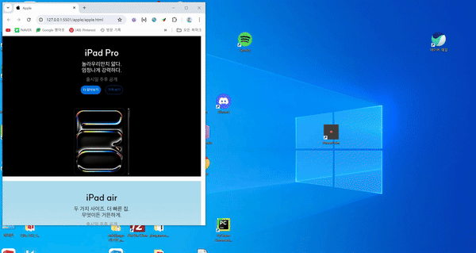

# apple 제품 카드



[작동사이트](https://akman12914.github.io/homework/apple/apple)

## 목차

1. [마크업](#마크업)
1. [스타일링](#스타일링)
1. [결론과 회고](#결론과-회고)

## 마크업

### div .container

- 전체를 감싸는 div 태그

### 카드 컴포넌트

> ### section .apple-product-card .black

- .black은 옵션 클래스로 검은 글자색상과 버튼을 가지고 있는 카드 컴포넌트를 의미한다.

> > ### hgroup .product
> >
> > > - h1 .product-name
> > > - p

> > > 제품명을 h1, 부가 설명을 p 태그로 설정하여 hgroup로 묶음
> >
> > ### p .not-released
> >
> > > 출시일 추후 공개 옵션
> >
> > ### a .detail & a .price
> >
> > > 링크를 이동하기 위한 a 태그, target="\_blank" rel="noopener noreferrer속성으로 보안 성능을 향상함

## 스타일링

### 카드 레이아웃

#### 가로 세로 / 정렬 설정

```css
height: var(--size);
block-size: var(--size);
text-align: center;
width: 100%;
inline-size: 100%;
```

#### 각 요소 간, 요소 별 여백 설정

```css
hgroup {
  padding-top: var(--large-spacing);
  padding-block-start: var(--large-spacing);

  h1 {
    margin-bottom: var(--small-spacing);
    margin-block-end: var(--small-spacing);
  }

  p {
    margin-top: var(--line-normal);
    margin-bottom: var(--line-normal);
    margin-block: var(--line-normal);
  }
}

.not-released {
  margin-top: var(--small-spacing);
  margin-block-start: var(--small-spacing);
}

a {
  margin-top: var(--small-spacing);
  margin-block-start: var(--small-spacing);
  padding: var(--x-small-spacing);
}
```

#### 버튼 스타일링

```css
display: inline-block;
/* 글자수에 맞춘 박스를 생성하는 inline속성과 가로세로를 지정할 수 있는 block속성을 동시에 사용함  */

&:hover {
  border: 1px solid var(--blue-200);
  background-color: var(--blue-200);
}
/* 마우스를 올려놓았을 시의 스타일링 변화 */
```

## Grid 레이아웃 (반응형)

### 전체 컨테이너

```css
.container {
  display: grid;
  gap: 1rem;
}

@media (min-width: 1024px) {
  .container {
    grid-template-columns: 1fr 1fr;
  }
}
```

### 아이템 설정

```css
.apple-product-card:nth-child(n) {
  background: url("이미지 주소") no-repeat center;
  grid-column: span 2;
  background-size: cover;
}
```

- .apple-product-card:nth-child(1~3) - span 2
- .apple-product-card:nth-child(4~7) - 1fr

해당 column 크기를 할당하여 container 크기에 따라 반응형으로 동작하게 작성

`@media (min-width: 1024px)`
화면 크기가 1024px 초과일 때
wide 이미지 적용,
카드 여백 및 글자 크기 조정

`@media (max-width: 1024px)`
화면 크기가 1024px 미만일 때

```css
apple-product-card: nth-child(4~7) - span 2;
```

두 열로 나눠지던 이미지들이 나눠지지 않도록 적용함

### 픽셀밀도가 2배일 때의 아이템 설정

```css
@media (-webkit-min-device-pixel-ratio: 2), (min-resolution: 2dppx);
```

**-webkit-min-device-pixel-ratio**

webkit 기반 브라우저에서 적용하는 비표준 픽셀 밀도 지정 형식.

디바이스의 픽셀 비율(Device Pixel Ratio, DPR)이 2 이상일 때 스타일이 적용한다.

**min-resolution**

resolution : 출력장치의 픽셀 밀도

해상도 단위로 적용되는 표준 픽셀 밀도 지정 형식. 하드웨어 픽셀 대 CSS px 비율이 2 이상인 화면(고해상도)에만 스타일이 적용된다.

## 결론과 회고

열심히 찾아보면서 마무리해서 기분이 좋다.
하지만 과제를 늦게 제출했으니 소용이 없다. 항상 **생각한 것보다 조금 더 일찍** 시작하는 것을 염두에 두자.

마무리를 해둔 만큼 선생님의 피드백 시간에 비교해보면서 점검을 해야겠다.
